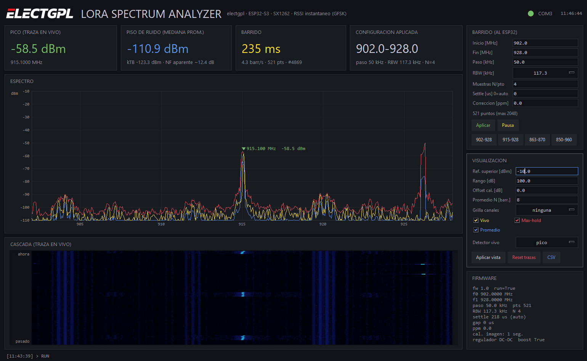
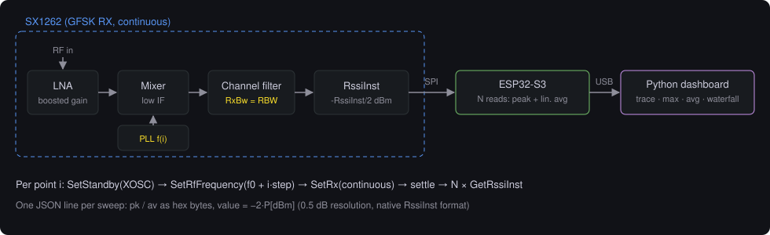
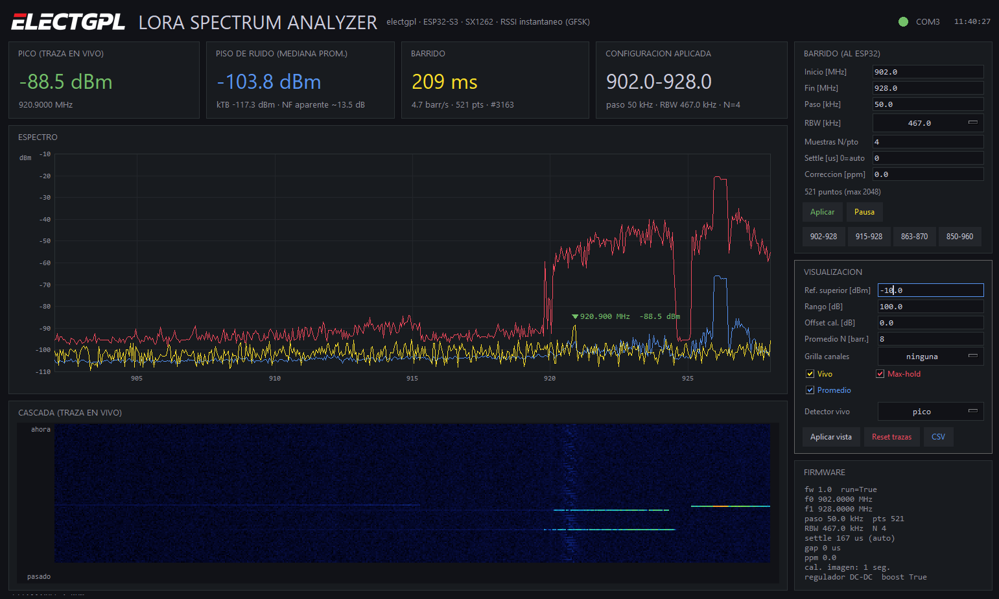
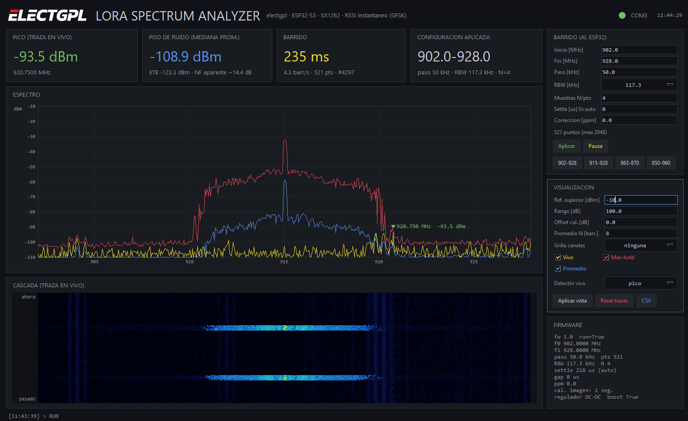

# LoRa Spectrum Analyzer — ESP32-S3 + SX1262

A swept-tuned spectrum analyzer for the sub-GHz ISM bands built from a stock **SX1262** LoRa transceiver and an **ESP32-S3**, with a live desktop dashboard in Python/Tkinter (spectrum, max-hold, average and waterfall).



The SX1262 has no spectrum-analyzer mode. This project uses it as a tunable receiver with a power detector: the GFSK channel filter acts as the resolution bandwidth (RBW) and the instantaneous RSSI register is the detector. The result is a cheap, useful tool to look at band occupancy, LoRa bursts and interference in the 902–928 MHz (or 863–870 MHz) band. It is also a good teaching platform for how a swept analyzer actually behaves, including its artifacts, which are documented below with real captures.

> **Not a calibrated instrument.** Absolute levels are uncalibrated, the receiver compresses with strong signals, and the board generates its own spurs. Read [Measurement limits](#measurement-limits-and-known-artifacts) before trusting a number.

---

## Contents

- [Features](#features)
- [How it works](#how-it-works)
- [Hardware](#hardware)
- [Firmware](#firmware)
- [Dashboard](#dashboard)
- [Serial protocol](#serial-protocol)
- [Reading the display](#reading-the-display)
- [Measurement limits and known artifacts](#measurement-limits-and-known-artifacts)
- [Recommended settings](#recommended-settings)
- [Bench validation procedures](#bench-validation-procedures)
- [Roadmap](#roadmap)
- [References](#references)
- [License](#license)

---

## Features

- Frequency range 150–960 MHz (SX1262 synthesizer), useful range limited by the module RF matching (≈860–930 MHz on 868/915 modules).
- RBW selectable among the 21 SX1262 GFSK bandwidths, 4.8–467 kHz.
- Up to 2048 points per sweep, 0.954 Hz synthesizer resolution, 0.5 dB amplitude resolution.
- Two detectors per point: **peak** and **average in linear power**.
- Image calibration over the sweep span, segmented automatically for wide spans.
- Crystal ppm correction, automatic or manual settling time.
- Dashboard: live / max-hold / exponential average traces, waterfall, peak marker, cursor readout, LoRaWAN US915/AU915 channel grids, SPI spur markers, CSV export.
- Reconfigurable live from the dashboard; no reflashing needed to change span, RBW or detector settings.

## How it works



**RBW.** In GFSK mode the SX1262 channel filter (RxBw) is selectable from 4.8 to 467 kHz and is used as the RBW. LoRa mode is not used: its filter is tied to the modem bandwidth and adds nothing for power measurement.

**Sweep.** For every point the firmware issues `SetStandby(XOSC)`, `SetRfFrequency`, `SetRx(continuous)`, waits a settling time (PLL lock, AGC, RSSI filter) and then reads `GetRssiInst` (opcode `0x15`) N times. Power is `P[dBm] = −RssiInst / 2`.

**Detectors.** Over the N reads per point:

| Detector | Computation | Use |
|---|---|---|
| Peak (`pk`) | maximum of N reads | short bursts, LoRa chirps with narrow RBW |
| Average (`av`) | mean in linear power, converted back to dBm | noise floor, steady signals |

Averaging in dB instead of linear power would read noise about 2.5 dB low, because of the Rayleigh distribution of the noise envelope (see Keysight AN 1303).

**Raw SPI.** The sweep loop drives the SX1262 with raw SPI commands instead of RadioLib calls. `startReceive()` rewrites IRQ, buffer and packet parameters every time, which is slow. RadioLib behavior also changed across versions in ways that matter here: an instantaneous RSSI fix in 7.0.2, and automatic image calibration on every frequency change since 7.1.0. RadioLib is used only for initialization: reset, regulator, startup calibration, GFSK setup, RxBw and boosted gain.

**Image calibration.** The SX1262 is a low-IF receiver. Without the right `CalibrateImage` for the band, a strong emitter shows a ghost at its image frequency. The firmware calibrates over `[floor(fmin/4), ceil(fmax/4)]` in 4 MHz units. Spans wider than `CAL_SEG_MHZ` (32 MHz) are recalibrated per segment during the sweep.

## Hardware

Tested on a custom ESP32-S3 board with an SX1262 module (**XTAL** variant, no TCXO, Wio-SX1262 style) and a GPIO-driven RF switch.

| SX1262 signal | ESP32-S3 GPIO |
|---|---|
| SCK | 12 |
| MISO | 13 |
| MOSI | 11 |
| NSS / CS | 10 |
| RESET | 18 |
| BUSY | 4 |
| DIO1 | 14 (not used by this firmware) |
| RF switch (LOW = RX) | 5 |
| Status LED | 47 (blinks every 16 sweeps) |

Notes for other hardware:

- **TCXO modules** (e.g. Elecrow ThinkNode M5, Heltec V3): call `radio.setTCXO(...)` with the module TCXO voltage, or pass it in `beginFSK()`. With an XTAL module, a TCXO voltage other than 0 makes `beginFSK()` fail with `-707`.
- **Modules switched by DIO2:** replace `setDio2AsRfSwitch(false)` with `true` and drop the `PIN_RFSW` handling.
- Any other peripheral on the board (sensors, fuel gauge, etc.) is left untouched.

## Firmware

Path: [`firmware/LoRaSA_ESP32S3_SX1262/LoRaSA_ESP32S3_SX1262.ino`](firmware/LoRaSA_ESP32S3_SX1262/LoRaSA_ESP32S3_SX1262.ino)

**Dependencies**

- Arduino core for ESP32 (arduino-esp32).
- [RadioLib](https://github.com/jgromes/RadioLib).

Compile-tested with arduino-esp32 2.0.9 + RadioLib 7.8.1, with no warnings at `-Wall -Wextra`. The APIs used also exist in arduino-esp32 3.x. In RadioLib 7.8 the positional `beginFSK()` overload is marked deprecated but still works.

**Arduino IDE board settings** — *ESP32S3 Dev Module*, 240 MHz, and:

| PC connection | USB CDC On Boot | `SERIAL_BAUD` |
|---|---|---|
| Native USB (GPIO19/20) | Enabled | ignored |
| USB-UART bridge on UART0 | Disabled | 921600 (115200 is too slow for the sweep data) |

**Compile-time options**

| Define | Default | Meaning |
|---|---|---|
| `DEF_F0_MHZ` / `DEF_F1_MHZ` | 902 / 928 | Default sweep (the dashboard overrides it on connect) |
| `DEF_STEP_KHZ` | 50 | Default step |
| `DEF_RBW_KHZ` | 117.3 | Default RBW (snapped to the nearest valid RxBw) |
| `DEF_NSAMP` | 4 | RSSI reads per point |
| `USE_LDO` | 0 | 1 = LDO regulator (no DC-DC switching spurs, about 2× RX current) |
| `RX_BOOSTED_GAIN` | 1 | Better NF, worse strong-signal handling |
| `CAL_SEG_MHZ` | 32 | Image calibration segment width |
| `SETTLE_BASE_US`, `SETTLE_K` | 150, 8e6 | Auto settle = `BASE + K / RBW[Hz]` µs |
| `SPI_RAW_HZ` | 8 MHz | SPI clock of the sweep path (see [spurs](#self-generated-spurs-spi-clock-harmonics)) |
| `MAX_PTS` | 2048 | Maximum points per sweep |

## Dashboard

Path: [`dashboard/lora_sa_dashboard.py`](dashboard/lora_sa_dashboard.py)

```
pip install -r dashboard/requirements.txt
```

The script needs no command-line arguments, so it runs directly from Thonny or any IDE. Edit the `USER CONFIGURATION` block at the top:

| Parameter | Default | Meaning |
|---|---|---|
| `PORT` | `"COM3"` | Serial port, or `None` to auto-detect by device id |
| `BAUD` | 921600 | Only used with a USB-UART bridge |
| `CFG_*` | 902–928 MHz, 50 kHz, 117.3 kHz, N=4 | Sweep sent to the ESP32 on connect |
| `REF_DBM`, `RANGE_DB` | −10, 100 | Vertical scale |
| `CAL_OFFSET_DB` | 0 | Absolute level correction |
| `AVERAGE_N` | 8 | Exponential average constant, in sweeps |
| `WATERFALL_PX` | 2 | Waterfall row height per sweep |
| `SPI_CLOCK_MHZ` | 8 | Must match `SPI_RAW_HZ`; used by the "SPI spurs" overlay |

An optional `electgpl_logo.png` next to the script is shown in the header.

**Controls**

- **Sweep panel:** start/stop, step, RBW, samples per point, settle time, crystal ppm correction, presets, Apply, Pause.
- **Display panel:** reference level, range, calibration offset, average constant, grid overlay (none / US915 / AU915 / SPI spurs / single marker), trace visibility, live detector (peak or average), Reset traces, CSV export.
- **Firmware panel:** echoes the configuration the firmware actually applied, including the snapped RBW and the effective settle time.

## Serial protocol

One JSON object per line. Device id: `electgpl-lora-sa`.

**Firmware → PC**

```jsonc
{"device":"electgpl-lora-sa","meta":true,"fw":"1.0","f0":902.0,"f1":928.0,"st":50.0,
 "n":521,"rbw":117.3,"ns":4,"settle_us":218,"settle_auto":true,"gap_us":0,"ppm":0.0,
 "segs":1,"reg":"DC-DC","boost":true,"run":true}                 // boot, after any command
{"device":"electgpl-lora-sa","log":"ERR","text":"..."}           // events
{"device":"electgpl-lora-sa","sw":4869,"f0":902.0,"st":50.0,"n":521,"t_us":235000,
 "pk":"DCDA...","av":"E0DE..."}                                   // one sweep
```

`pk` and `av` carry one byte per point in hex. The byte value is `−2·P[dBm]`, the native `RssiInst` format, so no resolution is lost. A 521-point sweep is about 2.2 kB.

**PC → firmware** (plain text, newline-terminated)

| Command | Effect |
|---|---|
| `CFG <f0_MHz> <f1_MHz> <step_kHz> <rbw_kHz> <N>` | New sweep (150–960 MHz, step ≥ 1 kHz, ≤ 2048 points, N 1–64) |
| `SETTLE <us>` | Settling time, `0` = automatic |
| `PPM <ppm>` | Crystal correction (signed) |
| `RUN` / `STOP` | Start / stop sweeping |
| `META` | Report configuration |

## Reading the display

A swept analyzer measures one frequency at a time, so **the horizontal axis is also a time axis**. Most surprises come from that.

### The RBW sets the shape of a narrow signal

A narrowband signal is drawn as its spectrum convolved with the RBW filter, about RBW + signal bandwidth wide. The SX1262 channel filter is a digital filter built for channel selectivity: flat passband, steep skirts. A carrier therefore shows up as a **flat-topped rectangle** about one RBW wide, not as the rounded peak of a lab analyzer with a Gaussian RBW. With RBW = 467 kHz this is very visible; use a narrower RBW to see the real occupied bandwidth.

### Horizontal lines in the waterfall are time, not bandwidth



- **Vertical line** in the waterfall: a stationary emitter.
- **Horizontal streak** one row tall: a burst shorter than a sweep. Its frequency extent only says *when* it started and stopped.

The span covered is burst duration × span / sweep time. In the capture above, a 4.7 MHz streak in a 26 MHz / 209 ms sweep is a burst of about 38 ms, consistent with a short low-SF LoRa packet.

Max-hold accumulates all of those streaks over minutes and builds wide "plateaus" that are not real occupied bandwidth. Reset the traces and look at the live trace before drawing conclusions.

## Measurement limits and known artifacts

### Receiver compression with strong signals



With a 915 MHz LoRa remote close to the antenna, the trace showed broad "shoulders" of ±4.7 MHz around the carrier. They span several sweeps with the same frequency extent, so this is a frequency-domain effect, not time gating. Removing the antenna (first screenshot of this README) settles where they come from:

| | Carrier | Shoulders | Ratio |
|---|---|---|---|
| With antenna | −33 dBm | ≈ −55 dBm | ≈ −22 dBc |
| Antenna removed | −58.5 dBm | below the floor (≈ −105 dBm) | < −47 dBc |

If the shoulders were really emitted by the transmitter, they would stay at −22 dBc and appear near −80 dBm. They dropped at least 2 dB per dB of carrier. That points to a **receiver non-linearity** (LNA/mixer/ADC compression and blocking ahead of the digital channel filter), not to the transmitter.

This also fits the physics of the transmitter side. LoRa is constant-envelope, so an overdriven PA produces harmonics but not adjacent spectral regrowth.

**Practical rule:** keep the displayed peak below about −50 dBm until the compression point of your board is measured with a step attenuator. `RX_BOOSTED_GAIN 0` improves strong-signal handling at the expense of noise figure.

### Self-generated spurs (SPI clock harmonics)

With the antenna removed, stable vertical lines remain in the waterfall at **904.0, 912.2, 920.0 and 927.8 MHz**. That is an exact 8 MHz grid: harmonics 113–116 of the 8 MHz SPI clock used by the sweep path. The SX1262 is reading `GetRssiInst` over SPI while it listens, so it partly measures its own bus activity. The lines are about 1.5 MHz wide because the SPI clock runs in short bursts (24 cycles ≈ 3 µs), not continuously.

- Use the **"SPI spurs" grid overlay** in the dashboard to flag them.
- Changing `SPI_RAW_HZ` moves them, which is a quick way to confirm. At 12 MHz they should appear at 912 and 924 MHz instead.
- No SPI clock ≤ 16 MHz keeps every harmonic out of 902–928 MHz, because the harmonic spacing is smaller than the 26 MHz band. Real mitigations: lower GPIO drive strength or series resistors on SCK/MOSI, fewer reads per point, careful layout.

This self-interference also contributes to the apparent noise figure. Measured floor: about −110.9 dBm at 117.3 kHz RBW, an apparent NF of 12–14 dB versus kTB, above what the SX1262 alone should give.

### Other limitations

- **Absolute level:** not calibrated, and it varies with frequency through the module RF matching. Use `CAL_OFFSET_DB` against a reference source measured with a calibrated instrument.
- **Out-of-band:** below about 860 MHz and above about 930 MHz, the module matching network attenuates and readings fall.
- **Frequency accuracy:** with an XTAL module, ±10–20 ppm means ±9–18 kHz at 915 MHz. This matters only with narrow RBW; use `PPM`.
- **Image response:** a strong emitter can produce a ghost if image calibration does not cover it. Wide spans are calibrated per segment.
- **Other internal spurs to check:** the 40 MHz ESP32-S3 crystal (23rd harmonic = 920 MHz, overlapping an SPI harmonic) and the 32 MHz SX1262 crystal (896 and 928 MHz). `USE_LDO 1` removes the SX1262 DC-DC converter as a spur source.
- **Sweep speed:** measured 209–235 ms for 521 points at RBW 117.3–467 kHz, about 4.5 sweeps/s. Settling time dominates and grows as RBW narrows.

## Recommended settings

| Goal | Span | RBW | Step | N | Detector / traces |
|---|---|---|---|---|---|
| Band overview | 902–928 MHz | 117.3 kHz | 50 kHz | 4 | peak, max-hold |
| Shape of one 125 kHz LoRa channel | ~1 MHz around the channel | 23.4–29.3 kHz | 10 kHz | 8 | peak + max-hold (the chirp sweeps the filter) |
| Noise floor / steady signals | as needed | ≥ 58.6 kHz | ≤ RBW/2 | 8–16 | average |
| Wide view | 850–960 MHz | 234.3 kHz | 200 kHz | 4 | peak |

Keep **step ≤ RBW/2** to avoid gaps and amplitude scalloping between points. The dashboard warns when step > RBW.

## Bench validation procedures

1. **Settling time.** Inject a CW at a fixed level. Increase `SETTLE` until the reading stops changing (within 0.5 dB), then compare with the automatic value.
2. **RBW shape.** Sweep the same CW with a 1 kHz step to plot the real channel-filter response for each RxBw.
3. **Compression point.** Add attenuation in 10 dB steps. Reading and attenuation should track dB for dB; where they stop tracking, the receiver is compressing.
4. **Internal spurs.** Replace the antenna with a 50 Ω load. Whatever remains is internal. An open port changes the LNA input match and noise, so use a load, not an open.
5. **Absolute level.** Measure a reference source with a calibrated analyzer and set `CAL_OFFSET_DB`.

## Roadmap

- **Zero-span mode:** RSSI against time at a fixed frequency, to measure burst duration and periodicity.
- **Spectral-scan (histogram) mode:** uses the Semtech SX126x patch available through RadioLib `uploadPatch()` / `spectralScanStart()`; useful for channel-occupancy statistics.
- Configurable GPIO drive strength for SCK/MOSI to reduce SPI spurs.
- Frequency-dependent calibration table.

## References

- Semtech, *SX1261/2 Long Range, Low Power, sub-GHz RF Transceiver* datasheet: commands `GetRssiInst`, `SetRfFrequency`, `CalibrateImage`, GFSK RxBw table, RX boosted gain.
- Keysight, *Spectrum and Signal Analyzer Measurements and Noise*, Application Note 1303.
- Keysight, *Spectrum Analysis Basics*, Application Note 150.
- LoRa Alliance, *RP002-1.0.x LoRaWAN Regional Parameters*: US915 / AU915 channel plans.
- [RadioLib](https://github.com/jgromes/RadioLib) by Jan Gromeš.

## License

MIT — see [LICENSE](LICENSE).

Made by **Electgpl**.
